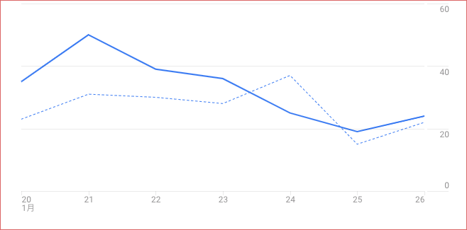

MyAccessAnalytics
===

PHP library which gets the result of Google Analytics.

## google-api-php-client

インストールしてgaディレクトリ直下に配置。

## To use AccessAnalytics

使うまでに

- 秘密鍵(p12ファイル)
- Consoleで取得できるメールアドレス
- ビューID

が必要になる。それらの取得方法を書く。

### google analytics 利用申し込み

`https://www.google.com/analytics/web/provision/?authuser=0#provision/SignUp/`

ここへ行って「お申し込み」選択。

`トラッキングの対象 アカウント名 ウェブサイト名 ウェブサイトのURL 業種 タイム・ゾーン`

とかそのへんを記載して、トラッキングコードを入手する。

### トラッキングコードを設置

htmlの &lt;head&gt; 部分にでも貼ればよい。

### APIコンソールでプロジェクトを作成

`https://console.developers.google.com/apis/library?hl=JA`

ここへ行って「その他一般的なAPI」のAnalytics APIを選択する。
画面の流れに従ってプロジェクトを作成する。

### Analytics APIを有効化と認証情報の追加

Analytics APIの有効化を選ぶと認証情報を追加しろと言われる。

Service Account作成を選ぶ。

    サービスアカウントは任意の名前
    秘密鍵の提供はP12

サービスアカウントを作成したら、秘密鍵とサービスアカウントのアドレスを取得しておく。P12はgaディレクトリ直下に配置。

### ビューIDを取得

`https://analytics.google.com/analytics/web/?hl=ja&pli=1#home/`

Analytics側に戻って「管理」->「ビュー設定」からビューIDを取得する。
example.phpの上の方にそれらについて記述する設定部分があるので、そこに打ち込んでGO。
